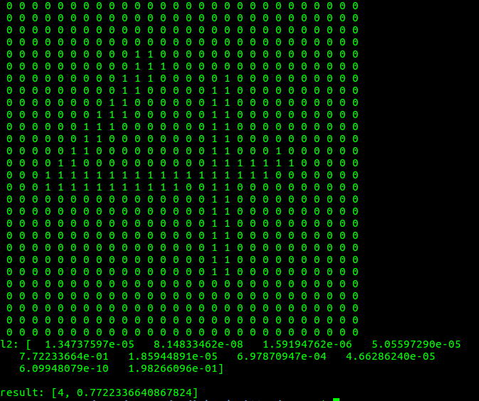

# Handwritten Recognition MLP - MNIST

A sample handwritten recognition using MNIST database. Project developed for Inteligência Artificial Aplicada grade at UFRN-Brazil. Brieffing at [https://www.youtube.com/watch?v=xOAaGZWQ9PY](https://www.youtube.com/watch?v=xOAaGZWQ9PY).

## Getting Started

This project is compound by two modules: Server in Python and an Android app as client.

### Server

The first step in server module is train the neural network and save the result weights: mnist_syn0.txt and mnist_syn1.txt. After that, it is possible to perform the tests with the file nn_mnist_test.py. With the neural network trained and tests Ok, just run the HTTP server http_server.py.

### Test example

Type the command at *Server* folder: **python nn_mnist_test.py sample_tests/4_test.bmp**:

### Client

To use the android client just install the app-debug.apk, located in Client/NNHandwritten/app-debug.apk

## Authors

* **Dhiogo Boza** - [dhiogoboza](https://github.com/dhiogoboza)

## License

This project is licensed under the MIT License - see the [LICENSE](LICENSE) file for details

